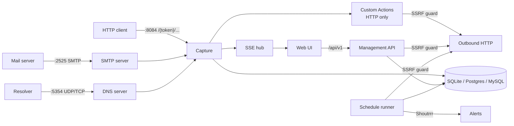

# Raptor

**Self-hosted webhook, email & DNS capture and inspection.** Spin up instant,
unique URLs, email addresses and DNS hostnames that capture, inspect, transform,
automate and forward inbound HTTP requests, emails and DNS queries — all from a
single static binary with an embedded UI.

Raptor is for developers who test webhook integrations, debug outbound email or
look for DNS/HTTP callbacks, and want a webhook.site-style tool they run on
their own hardware, with their data in their own database.

## Contents

- [Screenshots](#screenshots)
- [Features](#features)
- [How it works](#how-it-works)
- [Security](#security)
- [Quick start](#quick-start)
- [Configuration](#cli-flags)
- [Database](#database)
- [Storage & retention](#storage--retention)
- [API](#api)
- [Troubleshooting](#troubleshooting)
- [Development](#development)
- [Contributing](#contributing)
- [License](#license)

## Screenshots

### Inbox — light & dark

| Light | Dark |
| --- | --- |
|  |  |

### Search & Control Panel

| Search DSL | Control Panel |
| --- | --- |
|  |  |

### Email & DNS capture

| Email (rendered + auth checks) | DNS query |
| --- | --- |
|  |  |

### Custom Actions & Schedules

| Custom Actions | Schedules |
| --- | --- |
|  |  |

### Accounts & access control

Anonymous-by-default: a first visit gives you your own URL with no login; sign in
or register to keep your URLs across browsers.

| Anonymous first visit | Sign in / register | Account & users |
| --- | --- | --- |
|  |  |  |

### Mobile (responsive)

| Light | Dark |
| --- | --- |
|  |  |

## Features

### Capture & inspect

- **Instant capture URLs** — every method on any sub-path is recorded:
  `POST /{token}/any/path`. A URL is addressed by its UUID or by an optional
  **alias**, and the `/{token}/{statusCode}` form (exactly two path segments,
  code `100`–`599`) forces the response status for retry testing.
- **Full request inspection** — method, headers, query, body, client IP, host
  and user-agent, all captured and rendered, plus a raw HTTP view.
- **Real-time inbox** — new requests stream into the UI instantly over
  Server-Sent Events, with a 60-second polled fallback.
- **Configurable default response** — status, body, content-type, permissive
  CORS (`Access-Control-Allow-Origin: *`), and a `302` redirect, all editable
  per URL. A URL can also be created as a copy of another one (`clone_from`).
- **Guardrails** (all capture types — HTTP, email, DNS):
  - a `request_limit` ring buffer: only the newest N requests are kept.
  - an `expiry` TTL in seconds, counted from when the URL was created. After
    it, new traffic is rejected (HTTP answers `410 Gone`). A URL copied with
    `clone_from` keeps the source's creation time, so its expiry counts from
    the source URL's creation.
- **HTTP-only guardrails:**
  - a per-URL rate limit of `100 ÷ timeout` requests per minute, where
    `timeout` is a per-URL setting (`0` = unlimited). Over the limit, the
    caller gets `429` with `Retry-After: 60`.
  - a 10 MiB cap on the captured body (anything past it is not stored).

### Organise & manage

- **Search DSL** — filter the inbox with a Lucene-style query. Free text
  matches the body. Field terms: `method:POST`, `type:web|email|dns`,
  `content:charge`, `ip:1.2.3.4`, `host:`, `ua:`, `url:`, `query:`,
  `headers:value`, `headers.x-event:push`, `_exists_:custom_action_errors`
  (also `custom_action_output`, `content`), and date ranges like
  `created_at:[* TO now-14d]` (units `d`, `h`, `m`). Terms are ANDed; quote
  values that contain spaces.
- **Subset delete** — delete only the requests matching a search query or
  `date_from`/`date_to` window, or clear everything.
- **Groups** — organise URLs into colour-coded groups; the sidebar buckets them
  and a group can be deleted without losing its URLs.
- **Control Panel** — manage every URL and group from one table: reassign groups,
  open or delete URLs, and create/delete groups.
- **CSV export** — download a URL's captured requests (UUID, type, method, IP,
  host, user-agent, URL, size, timestamp, body).

### Inbound email capture

- An SMTP server captures mail sent to `{token}@{email-domain}` (a URL's alias
  works in place of its UUID, and `token+tag@…` subaddressing is accepted).
  Messages are MIME-parsed (subject, sender, HTML and plain bodies,
  **attachments**), and **DKIM/SPF/DMARC** are evaluated and shown as badges.
  HTML bodies render in a fully sandboxed iframe (no script execution).
- Recipients outside the email domain, or with no matching URL, are rejected
  with `550`, so the server is not an open relay. Messages are capped at 25 MiB
  and 100 recipients. There is no SMTP AUTH or STARTTLS: it is an inbound-only
  capture server.

### Inbound DNS capture

- A DNS server (UDP+TCP) captures queries for `{token}.{dns-domain}` and any
  subdomain (`anything.{token}.{dns-domain}`: the token is the label right
  before the domain). It records the query name, type and client IP.
- The answer is minimal: an `A` query gets `127.0.0.1` (TTL 60), any other type
  gets an empty `NOERROR`, and names with no matching URL get `NXDOMAIN`.

Email and DNS captures share the inbox, search, SSE stream and CSV export with
HTTP requests — filter them with `type:email` / `type:dns`. Custom Actions,
the rate limit and the `listen` hold-open run only for HTTP captures.

#### Exposing email & DNS

The SMTP (`2525`) and DNS (`5354`) listeners default to unprivileged ports. To
accept real mail/queries on the standard ports, put a port forward (or a TCP/UDP
proxy) in front (`25 → 2525`, `53 → 5354`), or set `--smtp-port 25` /
`--dns-port 53` where the process is allowed to bind them.

The default suffixes (`emailhook.site`, `dnshook.site`) are only placeholders:
you can't point DNS records at them. Use domains you control and tell Raptor
about them:

- **Email:** set `--email-domain` (e.g. `hooks.example.com`) and add an MX
  record for that domain pointing to a hostname that resolves to your Raptor
  host. Mail to `<token>@hooks.example.com` is then captured.
- **DNS:** set `--dns-domain` (e.g. `dns.example.com`) and delegate that zone
  to your host with an NS record (plus a glue/`A` record for the name server),
  so all `*.dns.example.com` queries reach Raptor.

  > **Caveat:** Raptor is not a full authoritative server. Queries for the zone
  > apex (`dns.example.com` itself) get `NXDOMAIN`, and it never answers SOA or
  > NS records, so some resolvers may handle the delegation poorly.
  <!-- TODO: verify — test the delegation against real public resolvers -->

### Custom Actions

Enable **Actions** on a URL to run an ordered chain on every captured HTTP
request. Actions share variables, can gate or stop the chain, extract data,
call out over HTTP, and build the response. Disabled actions are skipped.

**Variables** are referenced as `$name$`. Besides your own variables, these
read the captured request: `$request.content$` (or `$request.body$`),
`$request.method$`, `$request.ip$`, `$request.hostname$`,
`$request.query.x$`, `$request.header.x$` (case-insensitive), and, for email,
`$request.subject$` / `$request.sender$`.

| Type | Purpose |
| --- | --- |
| `set_variable` | Assign an (interpolated) `value` to a variable `name` |
| `modify_response` | Override response `status` / `content` / `content_type` / `headers` |
| `conditions` | Evaluate `input <operator> value`; if true, `stop` the chain or `skip` the next action |
| `extract_json` | Pull a value out of JSON via a [gjson](https://github.com/tidwall/gjson) `path` (source defaults to the body) |
| `extract_regex` | Capture a regex `group` (default `1`) into a variable (source defaults to the body) |
| `http_request` | Call another URL (JSON body or `forward` mode); response → `$response.status$` / `$response.body$` |
| `script` | Run JavaScript ([goja](https://github.com/dop251/goja)) with `request`, `respond()`, `get`/`set`, `stop()`, `dont_save()`, `echo()`, `JSON` |
| `dont_save` | Don't store the request (or its action run log) |
| `stop` | Halt the chain |

Details:

- **`conditions`** operators: `equals` (default), `not_equals`, `contains`,
  `not_contains`, `matches` (Go regular expression), `exists`, `not_exists`,
  `gt`, `lt` (numeric). Used with `stop`, it works as a simple header-based
  auth gate.
- **`http_request`** sends the configured `body` with `method` (default `POST`)
  and `content_type` (default `application/json`) plus custom `headers`. In
  `forward` mode it instead re-sends the captured method, body and headers
  (without `Authorization`, `Cookie` and `Proxy-Authorization`). The response
  prefix is configurable with `response_var` (default `response`). Requests time
  out after 15 s and at most 1 MiB of the response body is read. All calls go
  through the [SSRF guard](#security).
- **`script`** gets a `request` object (`content`, `method`, `ip`, `query`,
  `headers`; first value of each key). `respond(content[, status[, contentType]])`
  sets the response. Scripts run in an embedded goja VM with a **5-second**
  wall-clock limit. They have no network, filesystem or module access.

Each request stores a per-action **run log** (visible in the detail pane) and
the chain can be re-run against a stored request. Test a single action against
your latest request from the editor before saving.

### Schedules & monitoring

- Run a target URL (or a token's action chain) on a standard 5-field cron
  expression, with monitoring/alerting. The runner checks for due schedules
  every 30 seconds.
  - **status**: an expected code, or (with none set) any status `>= 400` is an
    alert. **keyword**: the response body (first 256 KiB) must contain a
    string. **uptime**: an unreachable host is an alert. **SSL**: the
    certificate expires within N days (default 14).
  - alerts are delivered via a **Shoutrrr** notify URL (Slack/Discord/Telegram/
    ntfy/Gotify/SMTP/…) on every run that doesn't pass. Each run is recorded
    with history, and schedules can be run on demand.
  - with `run_actions`, the schedule runs the token's action chain against an
    empty `GET` request instead, and alerts if any action errors.
- The notify URL is encrypted at rest and never returned by the API.

### Replay & response forwarding

- **Replay** — re-deliver a subset of captured requests (selected by the search
  DSL and/or a date window, up to 1000 per call) to a target URL, preserving
  method, body and headers (credentials stripped). The API returns only the
  `replayed` / `failed` counts.
- **Hold-open forwarding (`listen`)** — set a token's `listen` window (seconds)
  and each HTTP capture is held open until a client supplies the response via
  the set-response endpoint (`POST /api/v1/tokens/{id}/requests/{rid}/response`,
  body `{"status":200,"content_text":"…","headers":{…}}` or base64 `content`).
  A local process watching the stream can use this to answer the request with a
  dynamic response. If no response arrives in time, the default response is
  sent. A request is not held open when an action already set the response or
  `dont_save` fired. Raptor does not ship a CLI client for this: any HTTP client works.

### Accounts & access control

- **Anonymous by default** — like webhook.site, every visitor automatically gets
  their own identity (a cookie, kept for a year) and their own URLs, with no
  login required. On a first visit a URL is auto-created. Visitors only see and
  manage their own URLs; the capture endpoints stay public so anyone can
  deliver to a URL.
- **Optional login & registration** — visitors can register an account (their
  anonymous URLs migrate to it) and sign in from any browser. Registration is
  toggleable with `--allow-registration` / `RAPTOR_ALLOW_REGISTRATION`: turn it
  off to lock signups while still allowing existing users to log in. The first
  account is always allowed and becomes **admin**; an admin can also be seeded
  from the environment (`RAPTOR_ADMIN_EMAIL` / `RAPTOR_ADMIN_PASSWORD`) or reset
  from the CLI (`--reset-password`). Passwords need at least 8 characters
  (not enforced for the env-seeded admin).
- **Private mode** — set `--require-auth` to drop anonymous access entirely and
  require login for the whole management API. Until the first account exists
  the API stays open, so the first admin can be created.
- **Multi-user & roles** — admins manage users (admin/user roles) from the
  Account screen and see all URLs. Passwords are bcrypt-hashed.
- **Sessions & API keys** — the UI authenticates with a session cookie (valid
  for 7 days, `HttpOnly`, `SameSite=Lax`, `Secure` when `--base-url` is
  `https://`; the id is hashed at rest). API clients use `Api-Key: <key>` (keys
  are shown once and stored only as a SHA-256 hash). Basic Auth with
  email/password is also accepted.

### Platform

- **Modern UI** — React + TypeScript SPA embedded in the binary, system-aware
  light/dark theme with a persisted toggle, responsive from phone to desktop.
- **REST API first** — every UI action maps to a documented `/api/v1` endpoint;
  interactive Swagger UI at `/api/docs`.
- **Operations** — CSV export of captured requests, Prometheus metrics at
  `/metrics`, JSON health at `/health`.
- **Pick your database** — run on **SQLite** (default, zero-config), **PostgreSQL**
  or **MySQL** with the same schema; select it with `RAPTOR_DB_DRIVER` and point
  it at your server via environment variables. See [Database](#database).
- **Single binary** — pure-Go, `CGO_ENABLED=0`, all three database drivers
  CGO-free, the React UI embedded via `embed.FS`.

## How it works



One process serves everything. The HTTP listener carries the capture
catch-all, the management API (`/api/v1`), the API docs, `/health`, `/metrics`
and the embedded UI. The SMTP and DNS listeners feed the same capture pipeline.
If the SMTP or DNS listener fails to start, the error is logged and HTTP
capture keeps running.

## Security

Raptor accepts arbitrary inbound traffic from the internet and, if you enable
it, runs user-written scripts and makes outbound requests. Treat it as an
internet-facing service:

- **Exposure** — only the capture paths need to be public. Put a TLS-terminating
  reverse proxy in front, set `--base-url` to the `https://` URL (this also
  turns on `Secure` cookies), and consider `--require-auth` plus
  `--allow-registration=false` for anything that isn't a throwaway instance.
  With open registration, the first person to register on a fresh instance
  becomes admin, so seed the admin (`RAPTOR_ADMIN_EMAIL` /
  `RAPTOR_ADMIN_PASSWORD`) before exposing it. `/health` and `/metrics` are
  served without authentication.
- **Client IPs** — the recorded client IP comes from `X-Forwarded-For` /
  `X-Real-IP` when present. Raptor expects to run behind a proxy that sets
  these; without one, callers can spoof them.
- **Secrets at rest** — schedule notify URLs are encrypted with
  **AES-256-GCM**. The key is generated on first run and stored as `secret.key`
  in the data directory (mode `0600`). Lose the key and those secrets can't be
  decrypted. Passwords are bcrypt-hashed; session ids and API keys are stored
  only as SHA-256 hashes.
- **SSRF protection** — every server-side outbound request (Custom Actions
  `http_request`, replay, schedule monitoring) goes through one guard.
  Only `http`/`https` URLs are allowed. Internal targets (loopback, link-local
  incl. cloud metadata `169.254.169.254`, private and CGNAT ranges) are
  **blocked by default**, enforced against the *resolved* IP and re-checked
  across redirects. For actions and replay, scope hosts with `--action-allow`
  (a strict allow-list of host suffixes) / `--action-deny` (host suffixes, IPs
  or CIDRs); schedule monitoring gets only the resolved-IP checks (internal
  ranges and IP/CIDR deny entries). Permit internal targets with
  `--action-allow-internal`. Shoutrrr alert delivery does not go through this
  guard.
- **Script sandbox** — `script` actions run in an embedded JavaScript VM with no
  network, filesystem or module access and a 5-second time limit. There is no
  separate memory limit, so on a shared instance keep in mind that anyone who
  can create URLs can run scripts.
- **No credential leakage** — replay and `forward` mode strip `Authorization` /
  `Cookie` / `Proxy-Authorization` headers; captured email HTML renders in a
  sandboxed iframe; CSV export neutralises spreadsheet formula injection.
- **Multi-user caveat** — URLs and their requests are isolated per owner, but
  schedules and groups are not scoped per user.

## Quick start

### Docker Compose

```bash
docker compose up --build
# UI + API + capture: http://localhost:8084  (email :2525, DNS :5354/udp)
```

`--build` builds the image from this checkout; drop it to pull
`techblog/raptor:latest` instead. The compose file documents the optional
environment variables (database, accounts, email/DNS suffixes, action SSRF
policy) as comments — uncomment what you need. It also contains a commented-out
Postgres service.

### Docker

Use a **named volume** for `/data` (not a host bind mount: the image runs as a
non-root user, and a root-owned bind-mounted directory isn't writable). `/data`
holds the generated AES key (`secret.key`) and email attachments — and, with the
default SQLite driver, the database file too — so keep it. When using an external
**Postgres/MySQL** database, `/data` still holds the key and email attachments (persist it),
while captured data lives in your database.

```bash
docker volume create raptor-data
docker run -p 8084:8084 -p 2525:2525 -p 5354:5354/udp \
  -v raptor-data:/data \
  -e RAPTOR_BASE_URL=http://localhost:8084 \
  techblog/raptor:latest
```

Add `-p 5354:5354/tcp` if you also need DNS over TCP (the server listens on
both; the image and compose file only publish UDP).

Images are published multi-arch (`linux/amd64`, `linux/arm64`, `linux/arm/v7`)
to [`techblog/raptor`](https://hub.docker.com/r/techblog/raptor) on Docker Hub,
tagged `latest` and `YYYY.M.PATCH` (e.g. `2026.6.4`). The image is distroless
(`nonroot`) and its health check runs `/raptor --version`. See
[CLI flags](#cli-flags) for the full set of `--flag` / `RAPTOR_*` options (auth,
registration toggle, admin seeding, SSRF policy, …).

### Binaries

The Release workflow builds binaries for Linux (`amd64`, `arm64`, `armv7`,
`armv6`, `386`), macOS (`amd64`, `arm64`) and Windows (`amd64`, `arm64`),
named `raptor-<version>-<os>-<arch>`. No GitHub release has been published yet,
so for now use Docker or build from source.

### From source

Requires Go 1.25+ and Node.js 20+.

```bash
cd web && npm ci && npm run build && cd ..   # build & embed the UI
go build -o raptor ./cmd/raptor
./raptor --base-url http://localhost:8084 --data ./data
```

Without the UI build, the binary still runs and serves a placeholder page.

Then open <http://localhost:8084> — by default you immediately get **your own
URL** (no login needed). Send a request to it:

```bash
curl -X POST http://localhost:8084/<token>/demo \
  -H 'Content-Type: application/json' -d '{"hello":"world"}'
```

It appears in the inbox instantly.

### Running privately (accounts)

By default, Raptor allows anonymous use with open registration. For a
private, account-gated instance, seed an admin and require login:

```bash
docker run -p 8084:8084 -v raptor-data:/data \
  -e RAPTOR_BASE_URL=https://hooks.example.com \
  -e RAPTOR_REQUIRE_AUTH=true \
  -e RAPTOR_ALLOW_REGISTRATION=false \
  -e RAPTOR_ADMIN_EMAIL=admin@example.com \
  -e RAPTOR_ADMIN_PASSWORD=change-me-please \
  techblog/raptor:latest
```

The admin is only seeded while the instance has no users.

### Resetting a password

`--reset-password` prompts for an email and a new password (twice, at least 8
characters), then exits. If the account exists, its password is replaced and it
is promoted to admin; otherwise a new admin is created. Run it with the same
data/database settings as the server, for example:

```bash
docker exec -it <container> /raptor --reset-password
# or, with the binary:
./raptor --data ./data --reset-password
```

## CLI flags

| Flag | Env | Default | Purpose |
| --- | --- | --- | --- |
| `--port` | `RAPTOR_PORT` | `8084` | HTTP port (app + capture + API) |
| `--smtp-port` | `RAPTOR_SMTP_PORT` | `2525` | Inbound email listener |
| `--dns-port` | `RAPTOR_DNS_PORT` | `5354` | Inbound DNS listener (UDP + TCP) |
| `--data` | `RAPTOR_DATA` | `/data` | Data directory: SQLite file, `secret.key`, email attachments |
| `--db-driver` | `RAPTOR_DB_DRIVER` | `sqlite` | `sqlite` \| `postgres` \| `mysql` |
| `--db-host` | `RAPTOR_DB_HOST` | — | Database host (postgres/mysql; required unless `RAPTOR_DB_DSN` is set) |
| `--db-port` | `RAPTOR_DB_PORT` | `0` | Database port (`0` = driver default: 5432/3306) |
| `--db-name` | `RAPTOR_DB_NAME` | `raptor` | Database name (postgres/mysql) |
| `--db-user` | `RAPTOR_DB_USER` | — | Database user (postgres/mysql) |
| — | `RAPTOR_DB_PASSWORD` | — | Database password — **env only** (a secret) |
| `--db-sslmode` | `RAPTOR_DB_SSLMODE` | `disable` | Postgres TLS mode: `disable`\|`require`\|`verify-ca`\|`verify-full` |
| — | `RAPTOR_DB_DSN` | — | Full driver DSN override — **env only**; supersedes the fields above |
| `--base-url` | `RAPTOR_BASE_URL` | `http://localhost:8084` | External base URL for copyable links; `https://` enables `Secure` cookies |
| `--email-domain` | `RAPTOR_EMAIL_DOMAIN` | `emailhook.site` | Inbound email suffix |
| `--dns-domain` | `RAPTOR_DNS_DOMAIN` | `dnshook.site` | Inbound DNS suffix |
| `--max-requests` | `RAPTOR_MAX_REQUESTS` | `0` | Stored-request cap for URLs without their own `request_limit` (`0` = unlimited) |
| `--geoip-db` | `RAPTOR_GEOIP_DB` | — | MaxMind GeoLite2 DB path. Accepted, but no geo lookup is wired up in this version |
| `--log-level` | `RAPTOR_LOG_LEVEL` | `info` | `debug` \| `info` \| `warning` (or `warn`) \| `error` |
| `--require-auth` | `RAPTOR_REQUIRE_AUTH` | `false` | Require login for the management API (no anonymous access) |
| `--allow-registration` | `RAPTOR_ALLOW_REGISTRATION` | `true` | Allow new users to self-register |
| `--reset-password` | — | — | Interactively set an admin password and exit |
| — | `RAPTOR_ADMIN_EMAIL` | — | Seed an initial admin email (only when no users exist) |
| — | `RAPTOR_ADMIN_PASSWORD` | — | Seed the initial admin password (only when no users exist) |
| `--action-allow` | `RAPTOR_ACTION_ALLOW` | — | Comma-separated allow-list of host suffixes for outbound requests |
| `--action-deny` | `RAPTOR_ACTION_DENY` | — | Comma-separated deny-list (host suffixes, IPs, CIDRs) for outbound requests |
| `--action-allow-internal` | `RAPTOR_ACTION_ALLOW_INTERNAL` | `false` | Permit outbound requests to reach internal/loopback hosts |
| `--version`, `-v` | — | — | Print version and exit |

**Precedence:** environment variable → `--flag` → built-in default (an env var,
when set, overrides the flag). Boolean env vars take `true`/`false`/`1`/`0`; an
invalid number, boolean, log level or driver makes Raptor exit with an error.

## Database

Raptor runs on **SQLite** (default), **PostgreSQL** or **MySQL** — selected with
`RAPTOR_DB_DRIVER`. All three use an equivalent schema with per-driver migrations; pick whichever your deployment already operates. The driver is
pure-Go in every case, so the binary stays `CGO_ENABLED=0`.

- **SQLite** (default) — zero-config; the database file lives in `--data`
  (`/data/raptor.db`) alongside the encryption key. Ideal for single-node use.
- **PostgreSQL** — set the host/credentials and Raptor builds the DSN for you:

  ```bash
  RAPTOR_DB_DRIVER=postgres
  RAPTOR_DB_HOST=db
  RAPTOR_DB_PORT=5432          # optional (default 5432)
  RAPTOR_DB_NAME=raptor
  RAPTOR_DB_USER=raptor
  RAPTOR_DB_PASSWORD=secret
  RAPTOR_DB_SSLMODE=disable    # disable | require | verify-ca | verify-full
  ```

- **MySQL** (8.0.13+) — same structured settings:

  ```bash
  RAPTOR_DB_DRIVER=mysql
  RAPTOR_DB_HOST=db
  RAPTOR_DB_PORT=3306          # optional (default 3306)
  RAPTOR_DB_NAME=raptor
  RAPTOR_DB_USER=raptor
  RAPTOR_DB_PASSWORD=secret
  ```

Credentials come from the environment only (`RAPTOR_DB_PASSWORD` and the DSN are
never command-line flags). The target database must already exist; Raptor creates
and migrates its own tables on startup. To bypass the structured fields entirely,
set a ready-made DSN with **`RAPTOR_DB_DSN`** (it supersedes everything above):

```bash
# Postgres
RAPTOR_DB_DSN=postgres://raptor:secret@db:5432/raptor?sslmode=disable
# MySQL (Raptor forces ANSI_QUOTES/utf8mb4/UTC even on a DSN override)
RAPTOR_DB_DSN="raptor:secret@tcp(db:3306)/raptor"
```

> SQLite remains the simplest choice. Reach for Postgres/MySQL when you want a
> managed/shared database. Running several Raptor replicas against one store is
> not coordinated: each replica runs every schedule (no locking), and the SSE
> stream, rate limiting and the `listen` hand-off are all per-process.

## Storage & retention

- Captured requests are kept until you delete them. There is no time-based
  purge.
- A URL's `request_limit` (or `--max-requests` when the URL has none) keeps only
  the newest N requests; older ones are pruned as new ones arrive.
- An expired URL rejects new traffic (`410` for HTTP) but keeps its stored
  requests.
- Email attachments are written to `<data>/files/`. Deleting or pruning requests
  does not remove those files from disk.
- Requests can be deleted one by one, all at once, or by search/date subset
  (API or UI).

## API

The management API is versioned under `/api/v1` and is the contract the UI
consumes. The spec-first source of truth is [`openapi.yaml`](openapi.yaml)
(also served at `/api/openapi.yaml`), with an embedded **Swagger UI at
`/api/docs`** (works fully offline).

Key endpoints:

| Method | Path | Description |
| --- | --- | --- |
| `POST` | `/api/v1/tokens` | Create a capture URL (optional `clone_from`) |
| `GET` | `/api/v1/tokens` | List URLs |
| `GET` / `PUT` / `DELETE` | `/api/v1/tokens/{id}` | Get / update / delete a URL |
| `GET` | `/api/v1/tokens/{id}/requests` | List captured requests (`page`, `per_page` ≤ 100; `q`/`date_from`/`date_to` search) |
| `DELETE` | `/api/v1/tokens/{id}/requests` | Delete all, or a `q`/date subset |
| `GET` | `/api/v1/tokens/{id}/requests/latest` | Most recent request |
| `GET` / `DELETE` | `/api/v1/tokens/{id}/requests/{rid}` | Get / delete one request |
| `GET` | `/api/v1/tokens/{id}/requests/{rid}/raw` | Raw request text |
| `GET` | `/api/v1/tokens/{id}/requests/{rid}/files/{fid}` | Download an email attachment |
| `GET` | `/api/v1/tokens/{id}/requests.csv` | CSV export |
| `GET` | `/api/v1/tokens/{id}/stream` | SSE stream of new requests (`event: request`) |
| `GET` `POST` | `/api/v1/groups` | List / create groups |
| `PUT` `DELETE` | `/api/v1/groups/{id}` | Update / delete a group |
| `GET` | `/api/v1/action-types` | List the available action types |
| `GET` `POST` | `/api/v1/tokens/{id}/actions` | List / add Custom Actions |
| `PUT` `DELETE` | `/api/v1/tokens/{id}/actions/{aid}` | Update / delete an action |
| `POST` | `/api/v1/tokens/{id}/test-action` | Test an action against the latest request |
| `GET` | `/api/v1/tokens/{id}/requests/{rid}/action-runs` | Per-request action run log |
| `POST` | `/api/v1/tokens/{id}/requests/{rid}/execute` | Re-run the action chain against a stored request |
| `POST` | `/api/v1/tokens/{id}/requests/{rid}/response` | Supply a response (`listen` flow) |
| `POST` | `/api/v1/tokens/{id}/replay` | Replay a request subset to a target URL |
| `GET` `POST` | `/api/v1/schedules` | List / create schedules |
| `GET` `PUT` `DELETE` | `/api/v1/schedules/{id}` | Get / update / delete a schedule |
| `POST` | `/api/v1/schedules/{id}/run` | Run a schedule now |
| `GET` | `/api/v1/schedules/{id}/runs` | Schedule run history |
| `GET` | `/api/v1/auth/status` | Auth status, registration toggle + current user |
| `POST` | `/api/v1/auth/bootstrap` | Create the first admin (only while no users exist) |
| `POST` | `/api/v1/auth/register` | Register an account (first one becomes admin) |
| `POST` | `/api/v1/auth/login` `/logout` | Start / end a session |
| `GET` | `/api/v1/auth/me` | The signed-in user |
| `GET` `POST` | `/api/v1/account/api-keys` | List / create your API keys (signed-in users) |
| `DELETE` | `/api/v1/account/api-keys/{kid}` | Revoke an API key |
| `GET` `POST` | `/api/v1/users` | List / create users (admin) |
| `PUT` `DELETE` | `/api/v1/users/{id}` | Update / delete a user (admin) |
| `GET` | `/health` | `{"status":"ok","version":"…"}` (no auth) |
| `GET` | `/metrics` | Prometheus metrics (no auth) |

**Authentication.** By default the API allows anonymous use: each caller is
identified by a session cookie (logged-in), an `Api-Key: <key>` header, Basic
Auth, or an auto-issued anonymous owner cookie — and only sees their own URLs
(admins see all). With `--require-auth`, anonymous access is dropped and a
session, API key or Basic Auth is required for everything except
`/auth/status`, `/auth/login`, `/auth/register` and `/auth/bootstrap`.

Example with an API key:

```bash
curl -H "Api-Key: $RAPTOR_API_KEY" -X POST http://localhost:8084/api/v1/tokens \
  -H 'Content-Type: application/json' -d '{"alias":"github","cors":true}'
```

**Metrics.** Besides the standard Go and process collectors, `/metrics` exposes:

| Metric | Labels | Meaning |
| --- | --- | --- |
| `raptor_requests_captured_total` | `type` (`web`\|`email`\|`dns`) | Captured requests |
| `raptor_requests_rejected_total` | `reason` (`expired`\|`rate_limited`) | Requests rejected before capture |

## Troubleshooting

- **`unable to open database file` / permission errors in Docker** — `/data`
  must be writable by the image's non-root user. Use a named volume instead of a
  host bind mount.
- **Mail is rejected with `550 relay not permitted` / `no such mailbox`** — the
  recipient domain must equal `--email-domain`, and the local part must be an
  existing URL's UUID or alias.
- **DNS queries return `NXDOMAIN`** — the label right before `--dns-domain`
  must be an existing URL's UUID or alias.
- **A `listen` request ends with `504`** — the HTTP server stops every request
  after 60 seconds, so keep `listen` below that.
- **Raptor exits at startup with `requires RAPTOR_DB_HOST`** — the
  `postgres`/`mysql` drivers need `RAPTOR_DB_HOST` (or `--db-host`) or
  `RAPTOR_DB_DSN`.
- **Links in the UI point to `localhost`** — set `--base-url` /
  `RAPTOR_BASE_URL` to the external URL.

## Development

```bash
./scripts/dev.sh    # backend (:8084) + Vite dev server (:5173) with hot reload
go test ./...       # backend tests
cd web && npm run build   # produce the embedded UI bundle
VERSION=dev ./scripts/build.sh   # cross-compile the release matrix into dist/
```

The frontend lives in [`web/`](web) (React + TypeScript + Vite); its build output
is embedded into the Go binary via `embed.FS`, so production ships a single file.

Project layout:

```text
cmd/raptor/          entry point, --reset-password
internal/actions/    Custom Actions engine (incl. goja scripts)
internal/api/        /api/v1 handlers
internal/auth/       sessions, API keys, users, middleware
internal/capture/    HTTP capture, rate limit, listen forwarding
internal/config/     flags + env
internal/crypto/     AES-256-GCM secrets at rest
internal/dns/        DNS capture server
internal/email/      SMTP capture server + DKIM/SPF/DMARC
internal/netguard/   SSRF guard
internal/schedules/  cron runner + monitoring
internal/search/     search DSL → SQL
internal/store/      SQLite/Postgres/MySQL store + migrations
internal/webui/      embedded UI build
web/                 React frontend
openapi.yaml         API spec (served at /api/docs)
```

Versions follow `YYYY.M.PATCH`. The Release workflow builds binaries and
creates a GitHub release; the Docker workflow publishes `techblog/raptor`.

## Contributing

Issues and pull requests are welcome. Please run `go test ./...` and build the
UI before opening a PR, and keep `openapi.yaml` in sync with any API change.

## License

[Apache-2.0](LICENSE).
